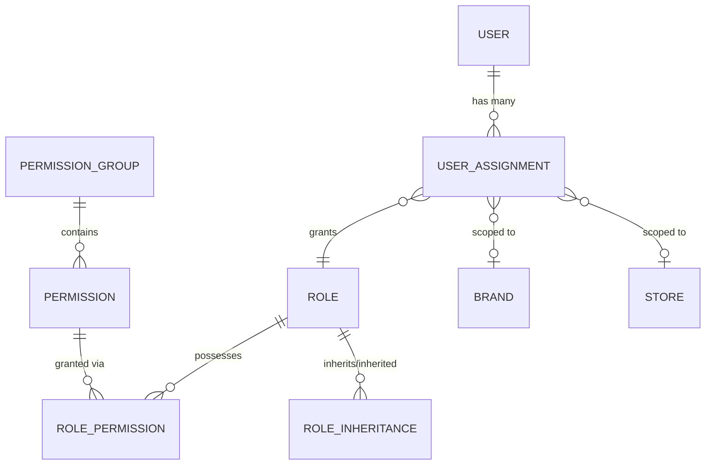

# Enterprise RBAC Database Architecture

## 1. Overview
The RBAC Database Architecture establishes the relational foundation required to support the Hybrid Context-Aware RBAC model. This schema bridges the gap between `User`, `Role`, and `Scope` while preserving legacy systems during the migration window.

## 2. Schema Additions
The following models constitute the RBAC foundation:

- **PermissionGroup**: Logical categorization (Module) for permissions.
- **Permission**: The atomic right to execute an action on a resource (`group_id`, `resource`, `action`).
- **RolePermission**: The junction table granting Permissions to a `Role`.
- **RoleInheritance**: Junction table enabling Controlled Role Inheritance (e.g., Parent Role inherits Child Role permissions).
- **UserAssignment**: The core contextual identity ledger, binding a `User` to a `Role` and optionally to a `brand_id` or `store_id`.

## 3. Relationships & ER Diagram



## 4. Backward Compatibility & Migration Phases
To ensure zero downtime and maintain application stability, the migration is strictly phased:

### Phase 1: Foundation (Current - EWO-R008)
- **Action**: Introduce new models (`PermissionGroup`, `Permission`, `RolePermission`, `UserAssignment`, `RoleInheritance`).
- **Compatibility**: The `User` model retains the legacy `role_id`, `brand_id`, and `store_id` fields. The `Role` model retains the legacy JSON `permissions` column. All existing Authentication and Authorization logic remains unchanged.

### Phase 2: Dual Write & Seed ✅ (EWO-R010 - COMPLETED)
- **Action**: Seed the new tables with the comprehensive enterprise permission set. The idempotent seed script populates 14 `PermissionGroup` entries, 84 `Permission` entries, 25 `Role` entries, and 278 `RolePermission` junctions.
- **Seed Documentation**: [RBAC Seeding Architecture](file:///g:/RESTAURANT_POS_WITH_BACKEND/docs/architecture/rbac-seeding.md)

### Phase 3: Application Switch (Future)
- **Action**: Update the backend Middleware and Authentication services to construct JWTs and evaluate permissions using `UserAssignment` and `RolePermission` instead of the legacy `User` fields.

### Phase 4: Cleanup (Future)
- **Action**: Once Phase 3 is stable in production, execute a final Prisma migration to permanently drop `role_id`, `brand_id`, `store_id` from `User`, and `permissions` from `Role`.

## 5. Future Cleanup Plan
The target end-state for the `User` model will be:
```prisma
model User {
  id                 Int      @id @default(autoincrement())
  emp_id             String?
  name               String
  email              String?
  phone              String   @unique
  designation        String?
  status             String   @default("ACTIVE")
  joining_date       DateTime?
  notes              String?
  hashedPin          String
  must_change_password Boolean @default(false)
  // DEPRECATED fields will be removed here.
}
```
