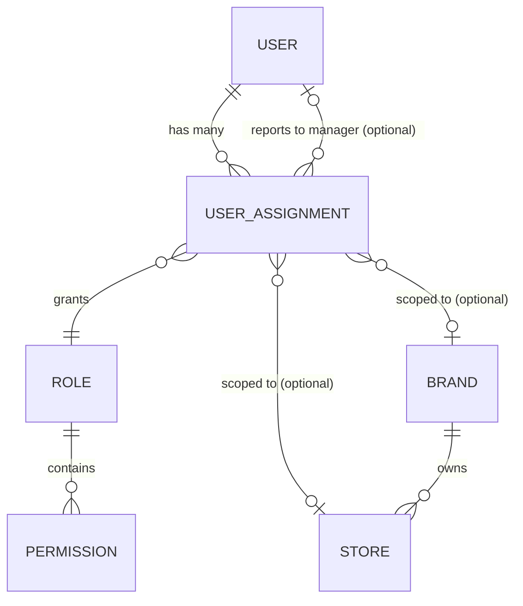

# Enterprise Identity & User Assignment Architecture

## 1. Identity Architecture Overview
The Enterprise Identity model separates the concept of a "User" (the person) from their "Role" (what they can do) and "Scope" (where they can do it). 

This decoupling is achieved by introducing the `UserAssignment` entity. A single `User` can have multiple `UserAssignment` records, each binding them to a specific `Role` at a specific `Scope` (Brand or Branch), effectively enabling multi-role, multi-branch, and cross-franchise capabilities.

## 2. Entity Relationship Diagram



## 3. UserAssignment Schema (Conceptual)

The `UserAssignment` model acts as the junction between Identity, Role, and Context.

```prisma
model UserAssignment {
  id                  Int       @id @default(autoincrement())
  user_id             Int       // Foreign Key to User
  role_id             Int       // Foreign Key to Role
  brand_id            Int?      // Null means global. Present means Brand-scoped.
  store_id            Int?      // Null means Brand-scoped. Present means Branch-scoped.
  
  // Assignment Lifecycle & Hierarchy
  is_primary          Boolean   @default(false)
  status              String    @default("ACTIVE") // ACTIVE, SUSPENDED, EXPIRED
  effective_from      DateTime  @default(now())
  effective_to        DateTime? // For temporary assignments
  
  // Reporting Line
  reporting_manager_id Int?     // Foreign Key to another User (Manager)
  
  // Audit Trail
  created_by          Int?
  updated_by          Int?
  createdAt           DateTime  @default(now())
  updatedAt           DateTime  @updatedAt
}
```

### Key Concepts:
- **Mandatory Fields**: `user_id`, `role_id`, `status`, `effective_from`.
- **Primary Assignment**: Denotes the default workspace/role a user logs into.
- **Temporary Assignments**: Enforced via `effective_to`. When the date passes, the assignment is organically ignored by the Authorization engine.
- **Reporting Manager**: Enables hierarchical workflows (e.g., leave approval, expense sign-offs).

## 4. Permission Resolution Flow
When a user attempts an action (e.g., "Void Order at Branch A"), the system resolves permissions dynamically based on the [Enterprise Permission Architecture](file:///g:/RESTAURANT_POS_WITH_BACKEND/docs/architecture/permissions.md):

1. **Context Extraction**: System extracts the Target Context from the request (e.g., `action: pos.orders.void`, `target_store_id: 5`).
2. **Assignment Lookup**: System fetches all `ACTIVE` `UserAssignments` for the current user where `effective_to` is null or in the future.
3. **Scope Matching**: System filters assignments that match the Target Context:
   - Does the user have a Global assignment? (No `brand_id`, No `store_id`) -> Match.
   - Does the user have a Brand assignment matching the branch's brand? (`brand_id == target_brand`, No `store_id`) -> Match.
   - Does the user have an exact Branch assignment? (`store_id == 5`) -> Match.
4. **Permission Evaluation**: For the matched assignments, evaluate the associated `Role` permissions. If *any* matched role contains `pos.orders.void`, grant access.
5. **Conflict Resolution**: Permissions are strictly additive (Union). There is no "explicit deny" override from another assignment. The system defaults to Deny unless a valid, in-scope assignment grants the permission.

## 5. Assignment Lifecycle
- **PROPOSED**: Assignment drafted but awaiting HR/Manager approval (Future use).
- **ACTIVE**: Currently in effect (`effective_from` <= now, `effective_to` is null or > now).
- **EXPIRED**: The `effective_to` date has passed. The system retains the record for auditing but ignores it for Authorization.
- **SUSPENDED**: Temporarily disabled by HR or Management without deleting the history.
- **TERMINATED**: Permanently revoked.

## 6. Security Model
- **Authentication Flow**: User logs in with `phone` + `pin`. The backend generates a JWT containing `user_id`, `assignment_ids[]`, and `active_assignment_id`. See [Enterprise Authentication Architecture](file:///g:/RESTAURANT_POS_WITH_BACKEND/docs/architecture/authentication.md) for the full login flow, session lifecycle, and multi-assignment strategy.
- **Authorization Flow**: The Scope Verification Middleware intercepts the request, determines the target scope from query params or body, and runs the Permission Resolution Flow. (See [Enterprise Authorization Architecture](file:///g:/RESTAURANT_POS_WITH_BACKEND/docs/architecture/authorization.md) for caching and failure matrices).
- **Brand & Branch Scope Enforcement**: A user explicitly scoped to `store_id: 5` cannot execute an action if the request targets `store_id: 6`, even if they hold a powerful Role like "Manager". The Scope Match fails.
- **Default Deny Strategy**: If a user lacks an active assignment matching the target scope, or if the matched assignments lack the specific permission, the request is instantly denied (`403 Forbidden`).

## 7. Migration Strategy (Future Work Order)
To safely migrate the existing flat `User` schema to this relational architecture without downtime, the Database Foundation (Phase 1) has been implemented (see [Enterprise RBAC Database Architecture](file:///g:/RESTAURANT_POS_WITH_BACKEND/docs/architecture/database-rbac.md)).

1. **Schema Update**: Introduced the `UserAssignment` table via Prisma migration in EWO-R008. Did *not* drop `role_id`, `brand_id`, or `store_id` from the `User` table.
2. **Data Backfill**: Run a migration script that creates one `UserAssignment` (marked as `is_primary = true`) for every existing `User`, copying their current `role_id`, `brand_id`, and `store_id`.
3. **Code Cutover**: Update the Authorization middleware and CRUD services to read from `UserAssignment` instead of the `User` table.
4. **Cleanup**: Once verified in production, drop the deprecated `role_id`, `brand_id`, and `store_id` columns from the `User` table in a final migration.

## 8. Future Compatibility
This architectural design natively satisfies all long-term business requirements:
- **Multi-Branch & Regional Managers**: A Regional Manager simply receives multiple `UserAssignment` records (one for each branch they manage) or a single Brand-scoped assignment if they oversee the entire brand.
- **Cloud Kitchens / Multi-Brand**: A single employee (`user_id: 123`) can have an assignment for Brand A (e.g., Pizza) and Brand B (e.g., Burgers) simultaneously.
- **Warehouse & Manufacturing**: New roles (e.g., "Warehouse Supervisor") can be scoped globally or to specific Warehouse branches without colliding with POS roles.
